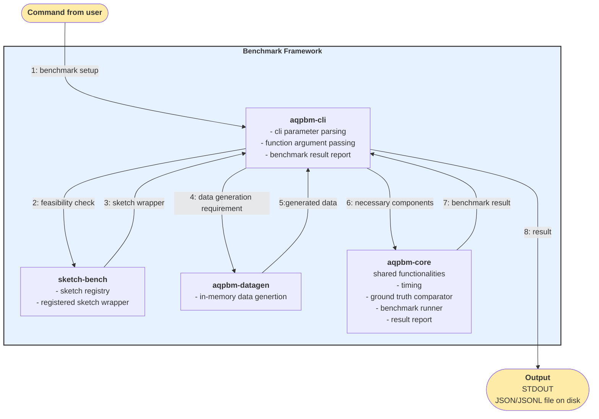

# Component Walk Through

This is the document for expected components and expected functionality of each component.

**Target audience:** users who happen to be interested in the general workflow of the benchmark
**Potential Developers:** documentation is on the way

## Overview

The repo is structured as a cargo workspace with following crates:

```rust
members = [
    "aqpbm-datagen",
    "aqpbm-core",
    "sketch-bench",
    "aqpbm-cli",
]
```

Notice: the `sketch-runtime` is a placeholder, which doesn't contain anything essential or meaningful or executable or understandable at this moment.

### Idea to keep in mind

The benchmark framework should add minimal overhead as well as not optimize away what is being benchmarked.

### Graphic View of structure


