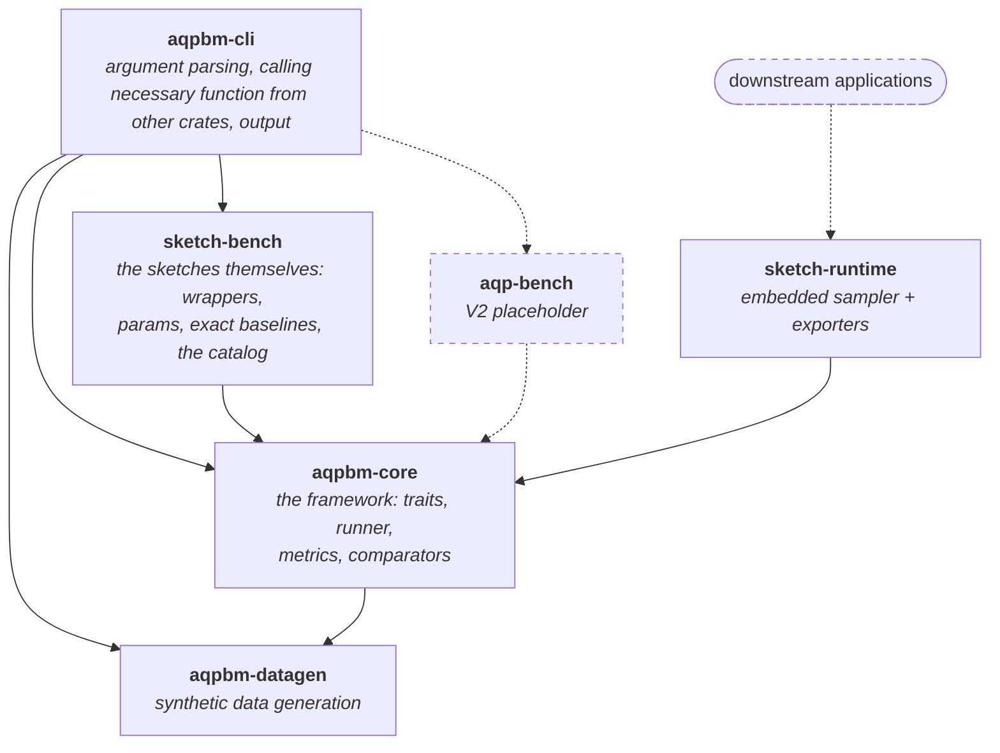

# Component Walk Through

This is the document for expected components and expected functionality of each component.
Currently it's a rough outline.
More detail will be added during manual code review and refactoring process.

## Overview

The repo is structured as a cargo workspace with following crates:

```
members = [
    "aqpbm-datagen",
    "aqpbm-core",
    "sketch-bench",
    "sketch-runtime",
    "aqpbm-cli",
]
```

### Idea to keep in mind

The benchmark framework should add minimal overhead as well as not optimize away what is being benchmarked.

### Graphic View of structure

Solid arrows are dependencies that exist today, as reported by `cargo tree`.
Dashed arrows are planned. An arrow points from a crate to what it depends on.



## aqpbm-core

This is where core functionality lives.

**Target.** Candidate functionality is:
- runner/sweeper that performs multiple run of something
- invocation of what to be executed
- warm-up of cpu
- timing functionality
- possibly more

**Today.** The generic benchmark engine now lives here in full — none of
it names a sketch family:
- `hot_loop`: cpu warm-up + the timed insert loop
- `runner`: `BenchRunner` (the multi-pass runner/sweeper) + `BenchConfig`
- `metrics`: the recorders (wall / CPU / RSS / jemalloc / heap-track /
  throughput), `MetricsMask`, and the per-run `RunMetrics` + `FullSink`
- `aggregation`: the Welford accumulator + N-run `aggregate` → `BenchSection`
- `accuracy`: the `GroundTruth` comparator trait + `Comparison`, the
  per-statistic capability traits (`CardinalityOps`, `FrequencyOps`,
  `QuantileOps`, `TopKOps`) and the comparators that score each — each binds
  a *capability*, not a family, so it scores anyone's implementation
- `init`: `InitSketch` / `BenchImpl` — the seam an implementation plugs into
- `cell`: `run_cell` / `score_cell` / `run_cell_parallel`, `Items`, `RunError`
- `latency`, `probe`, `sketch`, `workload`, `report`, `config` (params)

Together these make this crate the whole framework: implement its traits on
your own sketch and the runners will drive, score and report it, with no
registration step — nothing here holds a list of implementations.

Used to be `sketch-core`.

## aqpbm-datagen

Crate for input data generation.
It defines:
- distribution
- data range constraint

Data are generated in memory.
Interface to connect generated data to other locations, including: keep in memory, save to file, some specific DB.

Extracted from `sketch-core/src/datagen/` into a crate of its own.
`input/` still exists as a directory of pre-generated data files and their C++ generator

## aqpbm-cli

A common front-end that process input including command line argument and preferrably config file.

**Target.** The only functionality of this crate is to invoke corresponding
functionality of `sketch-bench` or `aqp-bench` or `other-bench`.

**Today.** Cleaned up.
- parse the command-line argument
- call corresponding function in `sketch-bench`
- operate datagen for workload passed to benchmark
- write output received from `sketch-bench`

Used to be `sketch-cli`.

## sketch-bench

Where sketch-primitive related instance is defined.
This crate connects to `aqpbm-cli` such that user can use this benchmark.

**Target.** Wrappers, sketch definition, and the measurement that is specific
to this domain.

**Today.** A bundle of implementations, not a framework — everything reusable
has moved to `aqpbm-core`, and what is left is the sketches themselves:
- `wrappers/`: the wrapped sketch implementations under test
- `catalog`: which `(family, impl)` pairs exist and how to run one
- `params`: per-family construction parameters (the only place family names
  are written)
- `legacy_csv`: the domain-specific long-format CSV rendering

The framework — the runner, metrics, aggregation, the `Sketch` / `InitSketch`
/ `BenchImpl` seam, the capability traits, the comparators and the cell
runners — is all `aqpbm-core`, which holds no list of implementations.
**Benchmarking a sketch of your own means depending on `aqpbm-core`, not on
this crate**: you implement its traits and call `cell::run_cell`, with no row
to add anywhere and no cost paid for the four sketch libraries wrapped here.

This crate exists for the CLI. `sketchlib bench --sketch hll --impl oxide`
arrives holding two strings, and `catalog` is what turns them into a concrete
Rust type. That is the only reason a list of implementations exists at all —
and it is also what lets a future `aqp-bench` sit parallel to `sketch-bench`
on the same core, each shipping its own catalog.

## sketch-runtime

This crate contains downstream application connection.
This will be adjusted later with more detail about how downstream application is expected to be connected.
The position of this crate may be changed: whether it depends on sketch-bench or is parallel to sketch-bench is unclear at this moment.

## aqp-bench (placeholder)

This part is postponed to V2, even name may be changed to "xxx-bench" (where xxx means something else).
It is listed here to indicate structure: this is a component parallel to sketch-bench and how it will connect to `aqpbm-cli` and backboned by `aqpbm-core`.

## Other language

This part is not started yet.
It is reasonable to have benchmark in other language.
Yet, not started.
