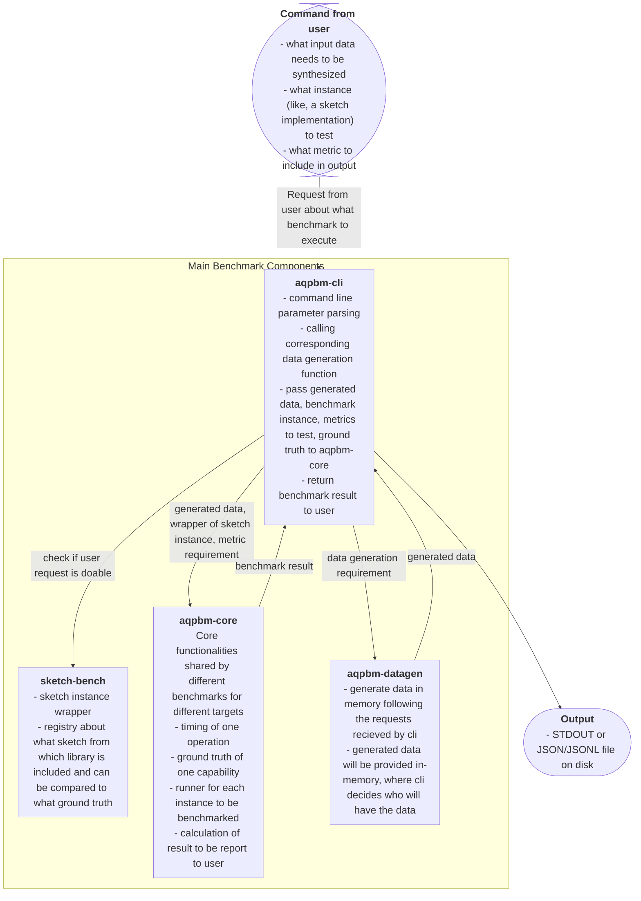

# Component Walk Through

This is the document for expected components and expected functionality of each component.

## Overview

The repo is structured as a cargo workspace with following crates:

```rust
members = [
    "aqpbm-datagen",
    "aqpbm-core",
    "sketch-bench",
    "sketch-runtime",
    "aqpbm-cli",
]
```

Notice: the `sketch-runtime` is a placeholder, which doesn't contain anything essential or meaningful or executable or understandable at this moment.

### Idea to keep in mind

The benchmark framework should add minimal overhead as well as not optimize away what is being benchmarked.

### Graphic View of structure



## aqpbm-core

Check [aqpbm-core](./aqpbm-core.md) for detail.

## aqpbm-datagen

Check [aqpbm-datagen](./aqpbm-datagen.md) for detail.

## aqpbm-cli

Check [aqpbm-cli](./aqpbm-cli.md) for detail.

A reference of expected cli parameters is in [aqpbm-cli-reference.md](./aqpbm-cli-reference.md).

## sketch-bench

Check [sketch-bench](./sketch-bench.md) for detail.

## sketch-runtime

No real implementation at this moment.
The directory exist, but no meaningful contents.

## aqp-bench (placeholder)

This part is postponed to V2, even name may be changed to "xxx-bench" (where xxx means something else).
It is listed here to indicate structure: this is a component parallel to sketch-bench and how it will connect to `aqpbm-cli` and backboned by `aqpbm-core`.

## Other language

This part is not started yet.
It is reasonable to have benchmark in other language.
Yet, not started.
