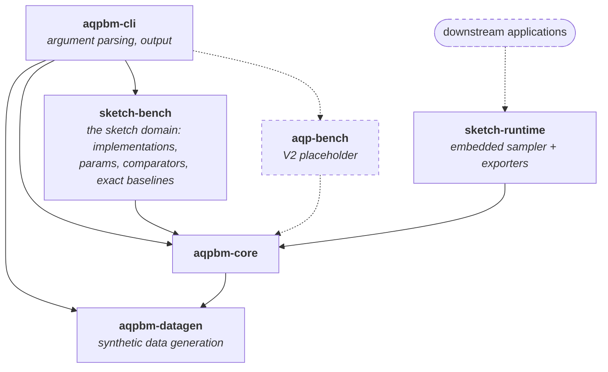

# Component Walk Through

This is the document for expected components and expected functionality of each component.
Currently it's a rough outline.
More detail will be added during manual code review and refactoring process.

## Overview

The repo is structured as a cargo workspace with following crates:

```
members = [
    "aqpbm-datagen",
    "aqpbm-core",
    "sketch-bench",
    "sketch-runtime",
    "aqpbm-cli",
]
```

### Idea to keep in mind

The benchmark framework should add minimal overhead as well as not optimize away what is being benchmarked.

### Graphic View of structure

Solid arrows are dependencies that exist today, as reported by `cargo tree`.
Dashed arrows are planned. An arrow points from a crate to what it depends on.



## aqpbm-core

This is where core functionality lives.

**Target.** Candidate functionality is:
- runner/sweeper that performs multiple run of something
- invocation of what to be executed
- warm-up of cpu
- timing functionality
- possibly more

**Today.** None of the four have landed yet.

Used to be `sketch-core`.

## aqpbm-datagen

Crate for input data generation.
It defines:
- distribution
- data range constraint

Data are generated in memory.
Interface to connect generated data to other locations, including: keep in memory, save to file, some specific DB.

Extracted from `sketch-core/src/datagen/` into a crate of its own.
`input/` still exists as a directory of pre-generated data files and their C++ generator

## aqpbm-cli

A common front-end that process input including command line argument and preferrably config file.

**Target.** The only functionality of this crate is to invoke corresponding
functionality of `sketch-bench` or `aqp-bench` or `other-bench`.

**Today.** Holds functionalities that should go to other crates.

Used to be `sketch-cli`.

## sketch-bench

Where sketch-primitive related instance is defined.
This crate connects to `aqpbm-cli` such that user can use this benchmark.

**Target.** Wrappers, sketch definition, and the measurement that is specific
to this domain.

**Today.** Messy.

## sketch-runtime

This crate contains downstream application connection.
This will be adjusted later with more detail about how downstream application is expected to be connected.
The position of this crate may be changed: whether it depends on sketch-bench or is parallel to sketch-bench is unclear at this moment.

## aqp-bench (placeholder)

This part is postponed to V2, even name may be changed to "xxx-bench" (where xxx means something else).
It is listed here to indicate structure: this is a component parallel to sketch-bench and how it will connect to `aqpbm-cli` and backboned by `aqpbm-core`.

## Other language

This part is not started yet.
It is reasonable to have benchmark in other language.
Yet, not started.
